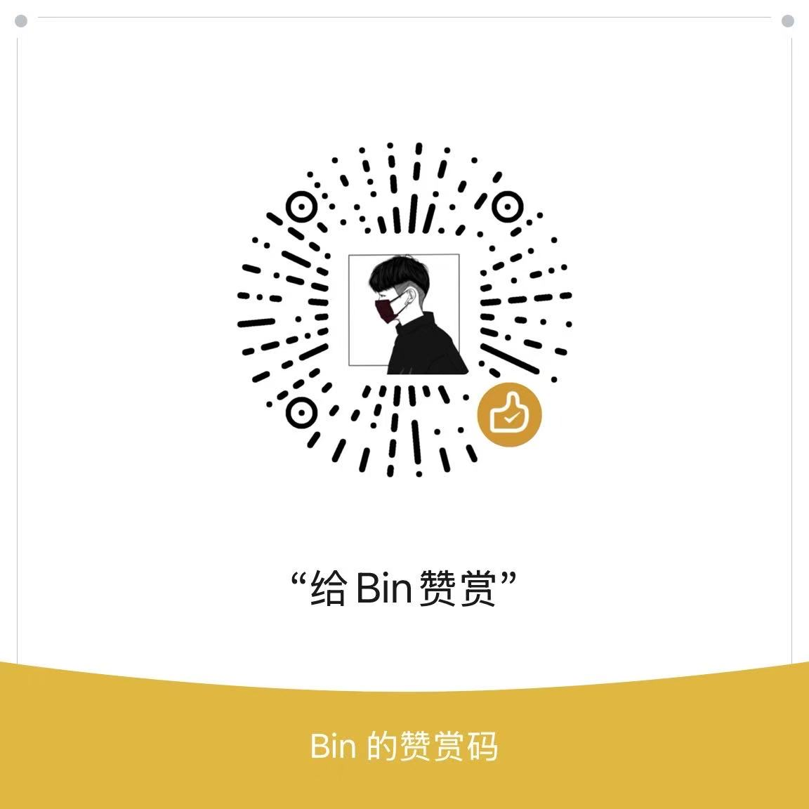

# ChatGPT Mirror 🚀

一个简单的使用go实现的 ChatGPT 代理服务，为团队和个人提供无障碍的 ChatGPT 访问体验。


[](https://t.me/Bink1783)
[](https://www.buymeacoffee.com/chatgptmirror)

## ✨ 核心特性

### 🔐 账号级别隔离
- **聊天记录完全隔离**：每个用户的对话历史独立存储，确保隐私安全
- **多用户支持**：支持团队多成员同时使用，互不干扰
- **权限管理**：灵活的用户权限控制和访问管理

### 🌐 无障碍访问
- **无需翻墙**：用户可直接访问，无需任何网络代理工具
- **原生体验**：完全复刻 ChatGPT 官方网站界面和功能
- **稳定连接**：优化的网络连接，确保服务稳定可靠

### 👥 灵活的账号管理
- **独立账号模式**：为每个团队成员分配独立的 ChatGPT 账号
- **共享账号模式**：多用户共享同一个 ChatGPT Plus 账号
- **混合模式**：支持独立账号与共享账号混合使用

### 🎛️ 强大的管理后台
- **用户管理**：创建、编辑、删除用户，设置用户权限
- **主账号管理**：添加、管理 ChatGPT Token，监控账号状态
- **关联管理**：灵活配置用户与主账号的关联关系
- **实时监控**：账号状态监控，异常告警

### 📦 套餐配置管理
- **主账号套餐配置**：为每个主账号设置不同的使用套餐
- **会话次数限制**：灵活配置时间段内的对话次数上限
- **时间窗口控制**：支持按小时、天、周、月等维度进行限制
- **自动重置机制**：到期自动重置使用次数，无需手动干预
- **多级限制策略**：支持全局限制、账号限制、用户限制多层级控制

## 🏗️ 技术架构

```
┌─────────────────┐    ┌──────────────────┐    ┌─────────────────┐
│   Web Frontend  │    │   Mirror Server  │    │   ChatGPT API   │
│                 │◄───┤                  │◄───┤                 │
│  - React UI     │    │  - Go Backend    │    │  - Official API │
│  - User Auth    │    │  - Token Mgmt    │    │  - GPT Models   │
│  - Chat History │    │  - User Isolation│    │  - Plus Features│
│  - Admin Panel  │    │  - Package Config│    │  - Rate Limiting│
└─────────────────┘    └──────────────────┘    └─────────────────┘
```

### 技术栈
- **后端**：Go + Gin + GORM
- **数据库**：MySQL + Redis
- **前端**：原生 JavaScript + HTML/CSS
- **部署**：Docker 支持

## 🚀 快速开始

### 环境要求
- Go >= 1.24
- MySQL >= 5.7
- Redis >= 6.0

### 安装部署

> ⚠️ **重要提示**：由于特殊原因，暂不支持本地源码部署。如有部署需要，请在 [Issues](https://github.com/Bin1783/chatgpt-mirror/issues) 中留言联系。

1. **克隆项目**
```bash
# 注意：仅用于查看源码结构和学习
git clone https://github.com/Bin1783/chatgpt-mirror.git
cd chatgpt-mirror
```

**如需部署服务，请通过以下方式联系：**
- 📧 在 [Issues](https://github.com/Bin1783/chatgpt-mirror/issues) 中创建部署需求
- 💬 在 [Discussions](https://github.com/Bin1783/chatgpt-mirror/discussions) 中讨论
- 📱 Telegram 联系：[@ChatGPTMirror](https://t.me/Bink1783)
**演示服务访问：**
- 用户界面：http://localhost:8082
- 管理后台：http://localhost:8082/admin
- 默认管理员账号：`BinRoot` / `BinRoot`

### Docker 部署

```bash
# 示例命令（需要完整配置）
cd chatgpt-mirror
docker-compose up -d
```

## 📖 使用指南

### 管理员操作

1. **登录管理后台**
   - 访问 `/admin`
   - 使用默认账号 `BinRoot/BinRoot` 登录

2. **添加主账号**
   - 在"主账号管理"页面添加 ChatGPT Token
   - 设置账号状态和限制规则

3. **创建用户**
   - 在"用户管理"页面创建用户
   - 为用户分配主账号或设置共享模式

### 用户操作

1. **获取访问权限**
   - 联系管理员创建账号
   - 获取专属的访问链接

2. **开始对话**
   - 点击访问链接自动登录
   - 享受与官网一致的 ChatGPT 体验

## 🔧 配置说明


### 环境变量

- `ENV`: 运行环境 (dev/prod)
- `CONFIG_PATH`: 配置文件路径
- `LOG_LEVEL`: 日志级别

## 🎯 核心功能详解

### 账号隔离机制
- 每个用户拥有独立的 `share_token`
- 基于 token 的会话管理和数据隔离
- 聊天记录按用户 ID 分别存储

### Token 管理
- 支持多个 ChatGPT 账号 Token
- 自动 Token 轮换和负载均衡
- Token 状态监控和异常处理

### 用户权限系统
- 基于角色的权限控制
- 用户与主账号的灵活关联
- 访问频率和功能限制

### 套餐配置系统
- **时间窗口配置**：支持1小时、1天、1周、1月等多种时间窗口
- **次数限制设置**：为每个时间窗口设置最大对话次数
- **超限处理机制**：达到限制后的自动处理和提示
- **动态调整功能**：管理员可随时调整套餐配置参数
- **配额分配策略**：支持按用户、按主账号、按时间段等多维度配额分配


## ⚠️ 重要声明

本项目仅供学习和研究使用，请遵守相关法律法规和 OpenAI 的使用条款。

- 请确保拥有合法的 ChatGPT 账号和使用权限
- 不得用于商业用途或违法活动
- 使用本项目产生的任何后果由使用者承担

## 📄 许可证

本项目采用 MIT 许可证 - 查看 [LICENSE](LICENSE) 文件了解详情。

## ☕ 支持我们

如果这个项目对你有帮助，可以请我们喝杯咖啡 ☕

### 赞助方式

<a href="https://www.buymeacoffee.com/chatgptmirror" target="_blank">
  
</a>

<details>
<summary>💰 <strong>点击展开赞赏码</strong></summary>

<br>

**微信赞助**



*扫描上方二维码，用微信支付赞助*


**赞助说明**
- 💝 任何金额的赞助都是对我们最大的鼓励
- 🚀 赞助资金将用于服务器维护和功能开发
- 🙏 感谢每一位支持者的慷慨赞助

</details>

### 其他支持方式

- ⭐ 给项目点个 Star
- 🔄 分享给更多需要的人
- 🐛 报告 Bug 和提出改进建议
- 💻 贡献代码和文档

每一份支持都是我们持续改进的动力！🚀

## 🆘 支持与反馈

- 🐛 [提交 Bug](https://github.com/Bin1783/chatgpt-mirror/issues)
- 💡 [功能建议](https://github.com/Bin1783/chatgpt-mirror/discussions)
- 📱 Telegram：[@ChatGPTMirror](https://t.me/Bink1783)

## 🙏 致谢

感谢所有为这个项目做出贡献的开发者们！

特别感谢：
- [OpenAI](https://openai.com) 提供的优秀 AI 服务
- [Gin](https://github.com/gin-gonic/gin) Web 框架
- [GORM](https://gorm.io) ORM 库
- 所有开源社区的贡献者

---

⭐ 如果这个项目对你有帮助，请给我们一个 Star！